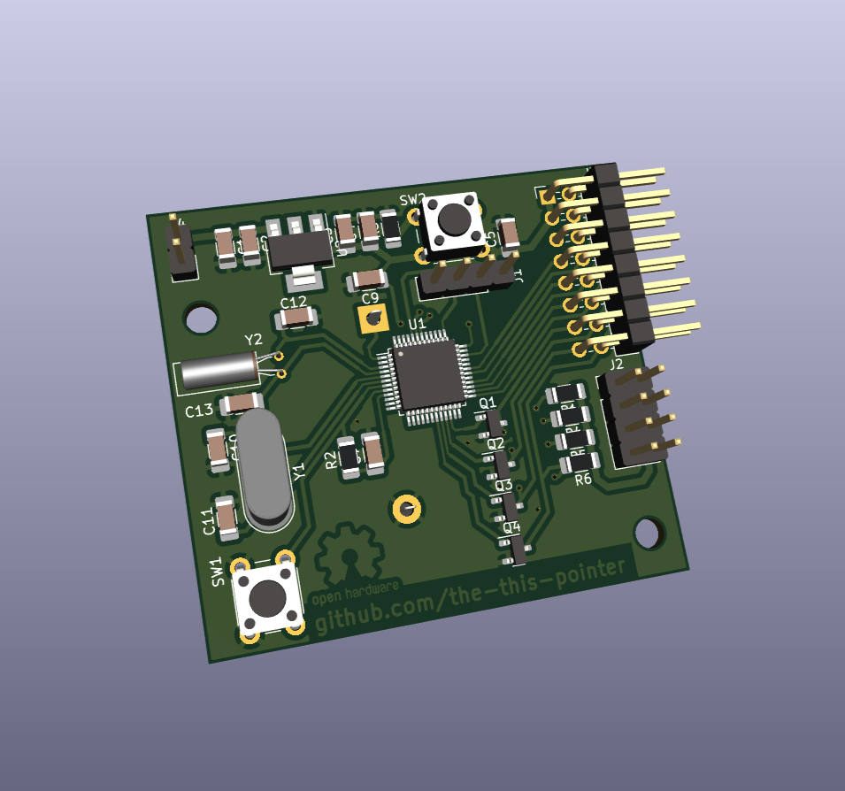
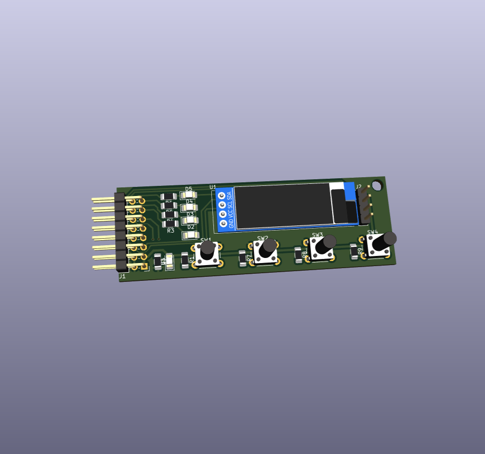

# Timer Board Design Files

This repository contains the KiCAD PCB design files for my <a href="https://github.com/the-this-pointer/timer-board-stm32f103" target="_blank">universal timer board</a>.

There are two PCBs for main board and a panel board to let user set the configuration.

Caution: The PCBs not tested yet!

Main board:

Panel board:

